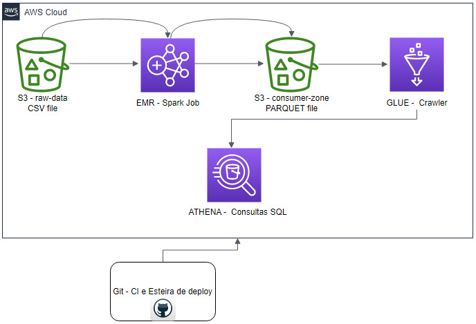

# EDC Modulo 1 Code IGTI ENEM 2020

# Bootcamp: Engenheiro(a) de Dados Cloud

# Use Cases a serem trabalhos

## 1 - Data Lake, EMR, GLUE e ATHENA:

Arquitetura da solução:

- Trabalho Prático

- Módulo 1: Fundamentos em Arquitetura de Dados e Soluções em Nuvem

- Objetivos de Ensino

- Exercitar os seguintes conceitos trabalhados no Módulo:

✔ Utilizar os principais serviços de nuvem para Engenharia de Dados
✔ Ingerir dados de maneira programática em bucket S3
✔ Implementar um pipeline de processamento de big data
✔ Disponibilizar dados para consulta usando engine de Data Lake
✔ Realizar consultas ad hoc para investigar os dados

- Enunciado

Você é Engenheiro(a) de Dados em uma grande instituição educacional. O gestor de sua
área iniciou um novo projeto de inteligência de dados com o objetivo de entender o
desempenho de alunos do ensino médio de todo o Brasil no Exame Nacional do Ensino
Médio (ENEM). Desse modo, você será responsável por construir um Data Lake com os
dados do ENEM 2020, realizar o processamento utilizando ferramental adequado e
disponibilizar o dado para consultas dos usuários de negócios e analistas de BI.
Para a realização dessa atividade, recomenda-se o uso dos serviços AWS. Contudo, caso
prefira, você poderá montar o seu lake e sua estrutura de processamento de dados em
qualquer provedor de nuvem que preferir.

- Atividades

- Você deverá desempenhar as seguintes atividades:

1. Realizar o download dos MICRODADOS do ENEM 2020. O arquivo está
disponível neste link: (https://www.gov.br/inep/pt-br/acesso-ainformacao/dados-abertos/microdados);

2. Criar um bucket chamado datalake-<seunome>-<numerodaconta> para
armazenamento dos dados crus do ENEM 2020;

3. Fazer a ingestão dos dados do ENEM 2020 em seu data lake numa pasta intitulada
raw-data utilizando o SDK de sua preferência ou a AWS CLI (Boto3 -
https://boto3.amazonaws.com/v1/documentation/api/latest/index.html; AWS CLI
- https://docs.aws.amazon.com/cli/latest/userguide/cli-chap-welcome.html e
https://awscli.amazonaws.com/v2/documentation/api/latest/index.html);

4. Fazer a transformação do CSV em parquet utilizando spark;

5. Escrever o parquet em uma outra pasta no bucket chamada consumer-zone;
6. Criar e executar um Glue Crawler para disponibilizar o schema dos dados do
ENEM 2020;

7. Realizar consultas SQL no AWS Athena para responder às perguntas do trabalho
prático.
